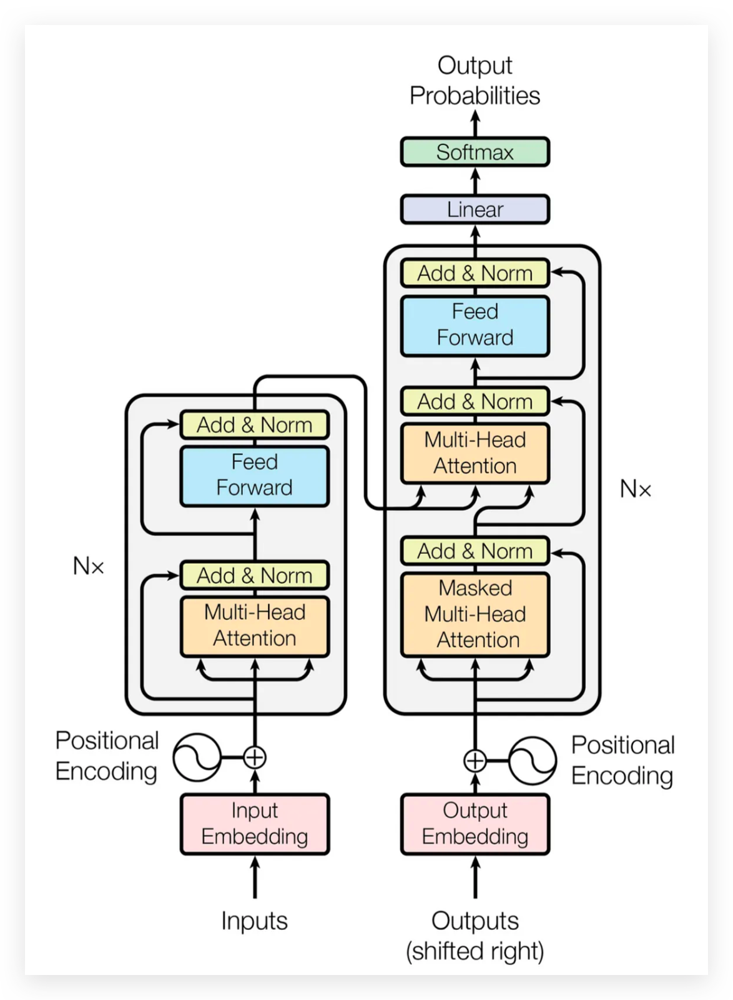

# Hands-on-transformer

This repository contains step-by-step implementations of the core components of the Transformer architecture in PyTorch.  
It is designed as a learning project to better understand how Transformers work under the hood.



## Requirements
Reference Environment:
- Python 3.10.18
- PyTorch 2.8.0
- Jupyter Notebook
- ...

## Quick Start
Clone the repository and run the notebooks step by step:

```bash
jupyter notebook
```
